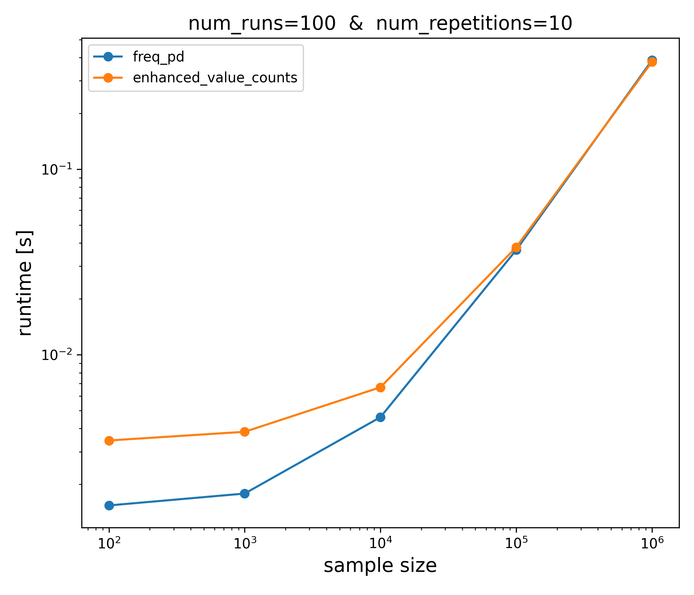

# Benchmark

```ipython
%load_ext watermark
```


```python
import pandas as pd
from IPython.display import HTML, display

from bumbag import core
```

```ipython
%watermark -v -m --iversions
```
```text
Python implementation: CPython
Python version       : 3.8.13
IPython version      : 8.4.0

Compiler    : GCC 7.5.0
OS          : Linux
Release     : 5.18.5-100.fc35.x86_64
Machine     : x86_64
Processor   : x86_64
CPU cores   : 3
Architecture: 64bit

pandas    : 1.4.2
matplotlib: 3.5.2
numpy     : 1.22.4
```

## `core` module

### `freq` versus `value_counts`


```python
from benchmark_freq_versus_value_counts import freq_pd, enhanced_value_counts
```


```python
print(core.get_source_code(freq_pd))
```

    def freq_pd(values):
        return pd.DataFrame(core.freq(values))
    


```python
print(core.get_source_code(enhanced_value_counts))
```

    def enhanced_value_counts(values):
        """Equivalent Pandas implementation of freq."""
        s = pd.Series(values).value_counts(
            sort=True,
            ascending=False,
            bins=None,
            dropna=False,
        )
    
        df = pd.DataFrame(s, columns=["n"])
        df["N"] = df["n"].cumsum()
        df["r"] = df["n"] / df["n"].sum()
        df["R"] = df["r"].cumsum()
    
        return df
    


```python
values = ["a", "c", "b", "g", "h", "a", "g", "a"]
```


```python
bb_output = freq_pd(values)
pd_output = enhanced_value_counts(values)
bb_output.equals(pd_output)
```


    True


```python
display(HTML(bb_output.to_html(col_space="30px")))
```


<table border="1" class="dataframe">
  <thead>
    <tr style="text-align: right;">
      <th style="min-width: 30px;"></th>
      <th style="min-width: 30px;">n</th>
      <th style="min-width: 30px;">N</th>
      <th style="min-width: 30px;">r</th>
      <th style="min-width: 30px;">R</th>
    </tr>
  </thead>
  <tbody>
    <tr>
      <th>a</th>
      <td>3</td>
      <td>3</td>
      <td>0.375</td>
      <td>0.375</td>
    </tr>
    <tr>
      <th>g</th>
      <td>2</td>
      <td>5</td>
      <td>0.250</td>
      <td>0.625</td>
    </tr>
    <tr>
      <th>c</th>
      <td>1</td>
      <td>6</td>
      <td>0.125</td>
      <td>0.750</td>
    </tr>
    <tr>
      <th>b</th>
      <td>1</td>
      <td>7</td>
      <td>0.125</td>
      <td>0.875</td>
    </tr>
    <tr>
      <th>h</th>
      <td>1</td>
      <td>8</td>
      <td>0.125</td>
      <td>1.000</td>
    </tr>
  </tbody>
</table>


```ipython
%%timeit -n 100 -r 10
freq_pd(values)
```
```text
1.66 ms ± 507 µs per loop (mean ± std. dev. of 10 runs, 100 loops each)
```

```ipython
%%timeit -n 100 -r 10
enhanced_value_counts(values)
```
```text
3.7 ms ± 448 µs per loop (mean ± std. dev. of 10 runs, 100 loops each)
```


```python
3.7 / 1.66
```


    2.2289156626506026


```ipython
%run -i "benchmark_freq_versus_value_counts.py"
```


